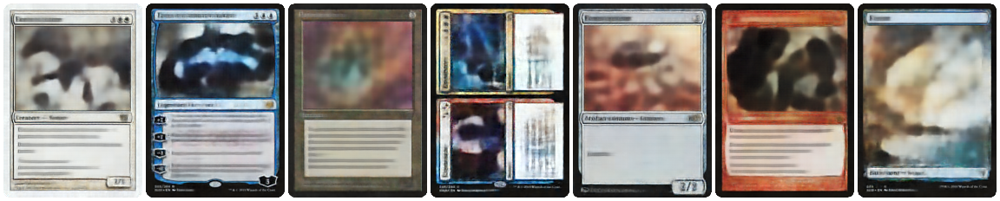

<p align="center">
    <h1 align="center">🧙‍♂️ Magic The Gathering ✨<br/>🧚‍♀️ Dataset 🧝‍♀️</h1>
    <p align="center">
        With automated multithreaded image downloading,<br/>caching and optional dataset conversion.
    </p>
</p>

<br/>

<p align="center">
    
    <p align="center">
        <i>Example reconstructions of dataset elements<br/>using a simple <a href="https://github.com/nmichlo/disent">Beta-VAE</a></i>
    </p>
</p>

<br/>

## ⚡️ &nbsp;Quickstart

1. Install `mtgdata` with `pip install mtgdata`

2. Prepare or convert the MTG data using the command line with `python -m mtgdata --help`


<br/>

## 📋 &nbsp;Features

**MTG Card Face Dataset**
- Automatically scrape and download card images from [Scryfall](https://scryfall.com)
- Multithreaded download through a randomized proxy list
- Only return valid images that are not placeholders
- Return all the faces of a card
- Normalise data, some images are incorrectly sized
- **Cached**

**Convert to HDF5**
- Convert the data to an hdf5 dataset
- Much faster than raw `jpg` or `png` image accesses
- Metadata json file allows linking back to original scryfall information.

**Pickle HD5F Dataset Class**
- Load the converted HDF5 dataset from disk from multiple threads / processes

<br/>

## ⬇️ &nbsp;Download Images

### Command Line

You can prepare (download) all the `normal` quality [images](https://scryfall.com/docs/api/images)
from the `default` Scryfall [bulk](https://scryfall.com/docs/api/bulk-data) data
by running `mtgdata/__main__.py`:

```bash
python3 mtgdata prepare --help
```

Otherwise, you can instead convert the downloaded images into an hdf5 dataset by running:

```bash
python3 mtgdata convert --help
```


### Programmatically

Alternatively you can download the images from within python by simply instantiating
the `mtgdata.ScryfallDataset` object. Similar arguments can be specified as that of the
command line approach.

```python3
from mtgdata import ScryfallDataset, ScryfallImageType, ScryfallBulkType

data = ScryfallDataset(
    img_type=ScryfallImageType.small,
    bulk_type=ScryfallBulkType.default_cards,
    transform=None,
)

# you can access the dataset elements like usual
```

<details>
<summary>Proxy Issues?</summary>

The scrape logic used to obtain the proxy list for `mtgdata.utils.proxy.ProxyDownloader` will
probably go out of date. You can override the *default* scrape logic used by the Dataset download
logic  by registering a new scrape function.

```python3
from doorway.x import proxies_register_scraper
from typing import List, Dict

@proxies_register_scraper(name='my_proxy_source', is_default=True)
def custom_proxy_scraper(proxy_type: str) -> List[Dict[str, str]]:
    # you should respect this setting
    assert proxy_type in ('all', 'http', 'https')
    # proxies is a list of dictionaries, where each dictionary only has one entry:
    # - the key is the protocol
    # - the value is the matching full url
    return [
        {'HTTP': 'http://<my-http-proxy>.com'},
        {'HTTPS': 'https://<my-https-proxy>.com'},
    ]
```

</details>

## 🔄 &nbsp;Convert Images to an HDF5 Dataset

### Command Line

The images can be convert to hdf5 format by running the file `mtgdata.scryfall_convert`.
Various arguments can be specified, please see the argparse arguments at the bottom of
the file for more information.

```bash
python3 mtgdata/scryfall_convert.py
```

The resulting data file will have the `data` key corresponding to the images data.

### Programmatically

Alternatively you can convert and generate the hdf5 dataset from within python by simply calling
the `mtgdata.scryfall_convert.generate_converted_dataset` function. Similar arguments can be specified
as that of the command line approach.

```python3
from mtgdata import generate_converted_dataset, ScryfallImageType, ScryfallBulkType

generate_converted_dataset(
    out_img_type=ScryfallImageType.small,
    out_bulk_type=ScryfallBulkType.default_cards,
    save_root='./data/converted/',
    out_obs_size_wh=(224, 160),
    convert_speed_test=True,
)
```

### Loading The Data

We provide a helper dataset class for loading this generated file.

```python3
from torch.utils.data import DataLoader
from mtgdata import Hdf5Dataset


# this h5py dataset supports pickling, and can be wrapped with a pytorch dataset.
data = Hdf5Dataset(
    h5_path='data/converted/mtg-default_cards-normal-60459x224x160x3.h5',  # name will differ
    h5_dataset_name='data',
    transform=None,
)

# you can wrap the dataset with a pytorch dataloader like usual, and specify more than one worker
dataloader = DataLoader(data, shuffle=True, num_workers=2, batch_size=64)

# to load the data into memory as a numpy array, you can call `data = data.numpy()`
# this will take a long time depending on your disk speed and use a lot of memory.
```
